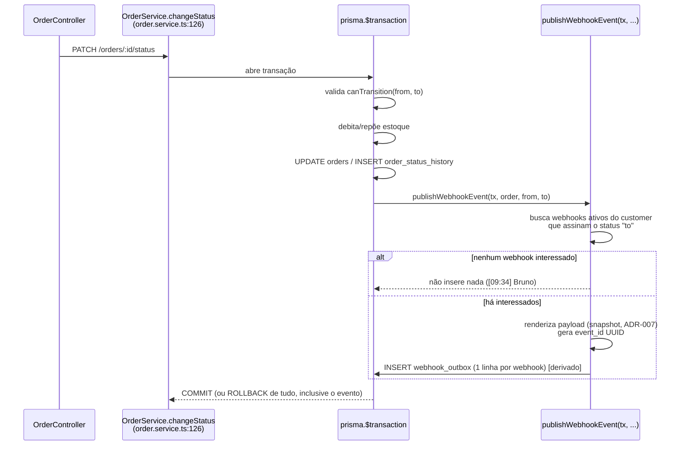
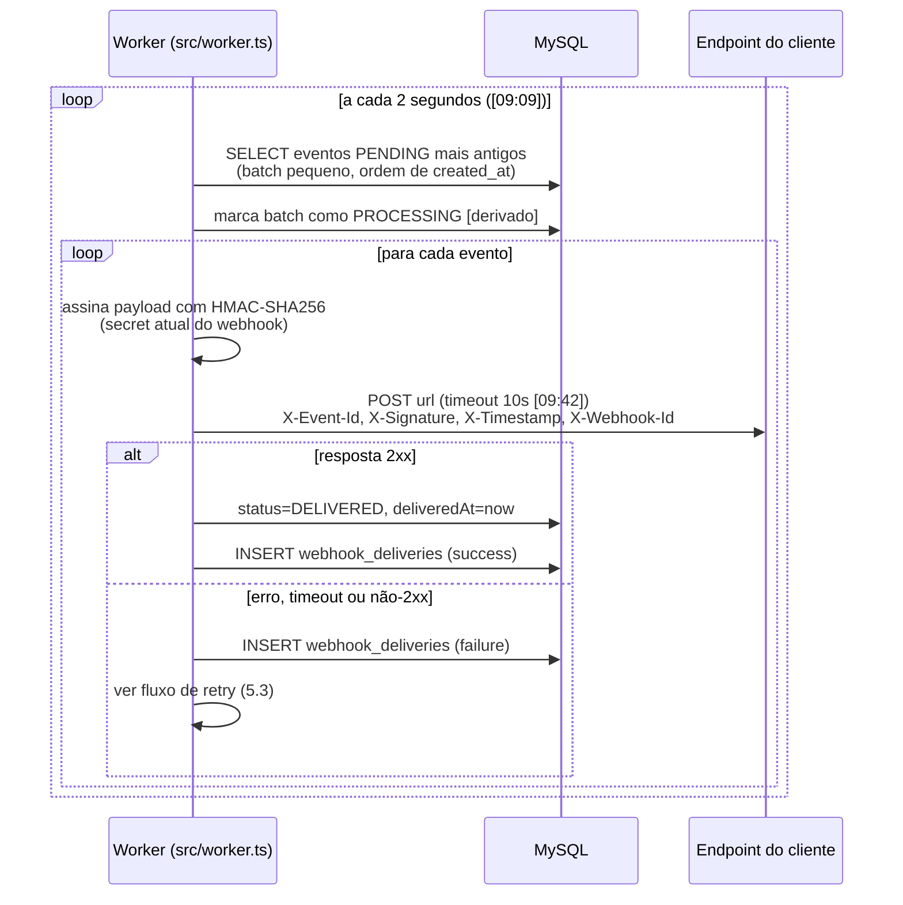
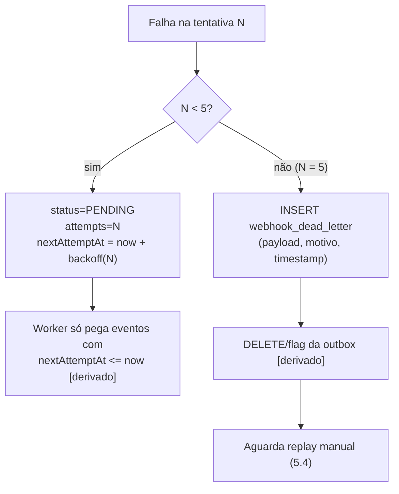

# FDD — Sistema de Webhooks de Notificação de Pedidos

| Campo | Valor |
| --- | --- |
| **Feature** | Webhooks outbound de notificação de mudança de status de pedidos |
| **Status** | Pronto para implementação |
| **Documentos relacionados** | [PRD](PRD.md) · [RFC](RFC.md) · [ADRs](adrs/) · [Tracker](TRACKER.md) |

> Convenção deste documento: itens marcados com **[derivado]** são detalhes de implementação que não foram ditos literalmente na reunião, mas decorrem diretamente de uma decisão registrada ou de um padrão existente no código. Tudo o mais tem origem literal na transcrição ou no código (ver [TRACKER.md](TRACKER.md)).

## 1. Contexto e motivação técnica

Clientes B2B fazem polling em `GET /orders` para detectar mudança de status, o que é lento e caro para eles ([09:00] Marcos). A plataforma precisa notificá-los ativamente em menos de 10 segundos ([09:02] Marcos).

O ponto técnico central: a mudança de status é executada por `OrderService.changeStatus` (`src/modules/orders/order.service.ts`, linhas 126–179) dentro de um único `prisma.$transaction` que valida a transição na máquina de estados (`src/modules/orders/order.status.ts`), atualiza `orders`, debita/repõe estoque e grava auditoria em `order_status_history`. A emissão do evento de webhook **precisa participar dessa mesma transação** — se ficar fora dela, perde-se a garantia de consistência ([09:40] Bruno, [09:41] Diego). Não existe hoje nenhum mecanismo de eventos, filas ou webhooks no código.

## 2. Objetivos técnicos

1. Registrar eventos de mudança de status de forma **atômica** com a transação existente (outbox — [ADR-001](adrs/ADR-001-outbox-transacional-no-mysql.md)).
2. Entregar os eventos por HTTP em **menos de 10s** ([09:02]), com polling de 2s ([09:10]).
3. Sobreviver a indisponibilidade de clientes por até ~15h via retry com backoff ([09:17]) e preservar falhas permanentes em DLQ reprocessável ([09:18]).
4. Permitir ao cliente autenticar origem e integridade de cada entrega (HMAC-SHA256 — [ADR-004](adrs/ADR-004-hmac-sha256-com-secret-por-endpoint.md)).
5. Não introduzir infraestrutura nem convenções novas ([ADR-006](adrs/ADR-006-reuso-dos-padroes-existentes-do-projeto.md)).

## 3. Escopo e exclusões

**No escopo:** CRUD de configuração de webhooks; filtro de eventos por status; outbox transacional; worker de entrega (`src/worker.ts`); retry + DLQ + replay admin; assinatura HMAC e rotação de secret; histórico de entregas por webhook.

**Fora do escopo** (decidido na reunião):
- E-mail de alerta ao cliente sobre webhook falhando — próxima fase ([09:37] Larissa)
- Rate limiting de envio — "observar e decidir depois" ([09:39] Larissa)
- Dashboard visual — projeto separado do time de frontend ([09:40] Larissa)
- Arquivamento de linhas entregues da outbox (~30 dias) — fora do escopo da feature ([09:08] Diego)
- Múltiplos workers em paralelo — "problema do futuro" ([09:13] Diego)
- Webhooks inbound (cliente → plataforma) — só outbound ([09:02] Marcos)

## 4. Modelo de dados **[derivado]**

Novos modelos em `prisma/schema.prisma`, com PK UUID seguindo o padrão do projeto ([09:51] Larissa: "Tudo é uuid"). Nomes de tabela em snake_case via `@@map`, como os existentes.

| Tabela | Campos principais | Origem |
| --- | --- | --- |
| `webhook_subscriptions` | `id` (uuid), `customerId`, `url`, `secret`, `previousSecret` + `previousSecretExpiresAt` (grace de 24h), `statuses` (lista de `OrderStatus` assinados), `active`, timestamps | [09:21] Bruno/Sofia: "url + secret + customer_id + estado ativo"; filtro de status [09:33] |
| `webhook_outbox` | `id` (uuid, **é o `event_id`** enviado em `X-Event-Id` — [09:25]), `webhookId`, `orderId`, `eventType`, `payload` (JSON snapshot — [ADR-007](adrs/ADR-007-payload-snapshot-na-insercao-da-outbox.md)), `status` (`PENDING`/`PROCESSING`/`FAILED`/`DELIVERED` — [09:08] Diego), `attempts`, `nextAttemptAt`, `createdAt`, `deliveredAt`. Índices em `status` e `createdAt` ([09:08]) | [09:06]–[09:08] |
| `webhook_deliveries` | `id`, `outboxEventId`, `webhookId`, `attempt`, `success`, `httpStatus`, `responseBody`, `durationMs`, `createdAt` | [09:34] Marcos: histórico com "sucesso/falha, payload, response, tempo de resposta" |
| `webhook_dead_letter` | `id`, `outboxEventId`, `webhookId`, `payload`, `failureReason`, `createdAt` | [09:18] Diego: "payload, motivo da falha e timestamp" |

## 5. Fluxos detalhados

### 5.1 Criação do evento na outbox (caminho quente)

O `changeStatus` passa a chamar `publishWebhookEvent(tx, order, fromStatus, toStatus)` — função que recebe o `TransactionClient` da transação corrente, em vez de injetar um repository inteiro no `OrderService` ([09:41] Bruno: "função publishWebhookEvent(tx, order, fromStatus, toStatus)"; [09:41] Diego: "função pura recebendo o tx").



Regras:
- Filtro aplicado **na inserção**: se nenhum webhook do customer assina o status de destino, nada é inserido — economiza linha na tabela ([09:33]–[09:34] Marcos/Bruno/Diego).
- Falha na inserção da outbox → rollback da mudança de status inteira. "Não pode ter caso de status mudar e evento não sair" ([09:40] Bruno).
- **[derivado]** O mesmo mecanismo se aplica à criação de pedido (`OrderService.create` grava history `null → PENDING`, `order.service.ts` linhas 106–113) caso algum webhook assine `PENDING`; a reunião tratou de "mudança de status", e a criação é a primeira transição registrada no history.

### 5.2 Processamento pelo worker

Entry-point `src/worker.ts` (modelo: `src/server.ts`), executada com `npm run worker`, processo separado da API ([09:11]), com `PrismaClient` próprio criado via `createPrismaClient()` de `src/config/database.ts` ([09:30] Bruno: "PrismaClient é por processo").



- Ordem de processamento: `created_at` ascendente, single-worker → ordering por pedido preservada ([09:12] Diego).
- **[derivado]** Sucesso = resposta HTTP 2xx; qualquer outro status, erro de rede ou timeout conta como falha. Decorre de [09:42] (timeout tratado como falha) e do comportamento padrão de webhooks citado como referência por Diego em [09:25] (Stripe/GitHub).

### 5.3 Retry e DLQ



Progressão do backoff ([09:17] Diego; [09:17] Larissa: "Decidido"):

| Tentativa | Espera após a falha anterior | Tempo acumulado desde a 1ª falha |
| --- | --- | --- |
| 2ª | 1 minuto | 1m |
| 3ª | 5 minutos | 6m |
| 4ª | 30 minutos | 36m |
| 5ª | 2 horas | 2h36m |
| — DLQ | 12 horas (após a 5ª falha) | ~14h36m ("quase 15 horas" — [09:17]) |

### 5.4 Replay manual da DLQ

`POST /api/v1/admin/webhooks/dead-letter/:id/replay` ([09:18] Diego) recoloca o evento na outbox como `PENDING` com contador de tentativas zerado **[derivado]**. Exige role `ADMIN` via `requireRole('ADMIN')` de `src/middlewares/auth.middleware.ts` e **loga quem executou o replay** para auditoria ([09:36] Sofia/Larissa). O reenvio pode gerar duplicata no cliente — coberto pela semântica at-least-once ([ADR-005](adrs/ADR-005-entrega-at-least-once-com-x-event-id.md)).

## 6. Contratos públicos

Todos os endpoints ficam sob `/api/v1` (padrão de `src/app.ts`), exigem `Authorization: Bearer <JWT>` (`authenticate`) e respondem erros no envelope do `error.middleware.ts`: `{ "error": { "code", "message", "details?" } }`. O `customer_id` vai no body/path, **não** vem do JWT ([09:32] Larissa). CRUD aceita qualquer role autenticada; apenas o replay exige `ADMIN` ([09:36]–[09:37] Sofia).

### 6.1 `POST /api/v1/webhooks` — cadastrar webhook ([09:31])

Request:
```json
{
  "customerId": "c3a1f5e0-6a3a-4b1e-9d2f-8f0a1b2c3d4e",
  "url": "https://integracao.atlascomercial.com.br/oms/webhook",
  "statuses": ["SHIPPED", "DELIVERED"]
}
```

Response `201 Created` — a secret é gerada pela plataforma e **devolvida na criação** ([09:31] Marcos); é a única vez que aparece em claro **[derivado]**:
```json
{
  "id": "7f9b2c4d-1e2f-4a5b-8c9d-0e1f2a3b4c5d",
  "customerId": "c3a1f5e0-6a3a-4b1e-9d2f-8f0a1b2c3d4e",
  "url": "https://integracao.atlascomercial.com.br/oms/webhook",
  "statuses": ["SHIPPED", "DELIVERED"],
  "active": true,
  "secret": "whsec_9f8e7d6c5b4a3f2e1d0c9b8a7f6e5d4c",
  "createdAt": "2024-11-07T12:00:00.000Z"
}
```

Erros: `400 WEBHOOK_INVALID_URL` (url `http` — [09:23]), `400 VALIDATION_ERROR` (Zod), `404 NOT_FOUND` (customer inexistente), `401 UNAUTHORIZED`.

### 6.2 `GET /api/v1/webhooks?customerId=...` — listar webhooks de um customer ([09:32] Bruno)

Response `200 OK` (paginado no padrão de `src/shared/http/response.ts` **[derivado]**; secret nunca retorna após a criação **[derivado]**):
```json
{
  "data": [
    {
      "id": "7f9b2c4d-1e2f-4a5b-8c9d-0e1f2a3b4c5d",
      "customerId": "c3a1f5e0-6a3a-4b1e-9d2f-8f0a1b2c3d4e",
      "url": "https://integracao.atlascomercial.com.br/oms/webhook",
      "statuses": ["SHIPPED", "DELIVERED"],
      "active": true,
      "createdAt": "2024-11-07T12:00:00.000Z"
    }
  ],
  "meta": { "page": 1, "pageSize": 20, "total": 1, "totalPages": 1 }
}
```

### 6.3 `PATCH /api/v1/webhooks/:id` — editar ([09:32] Bruno)

Request (campos opcionais):
```json
{
  "url": "https://nova-url.atlascomercial.com.br/oms/webhook",
  "statuses": ["PAID", "SHIPPED", "DELIVERED"],
  "active": false
}
```

Response `200 OK` com o recurso atualizado (sem secret). Erros: `404 WEBHOOK_NOT_FOUND`, `400 WEBHOOK_INVALID_URL`, `400 VALIDATION_ERROR`.

### 6.4 `DELETE /api/v1/webhooks/:id` — remover ([09:32] Bruno)

Response `204 No Content` **[derivado]**. Erro: `404 WEBHOOK_NOT_FOUND`.

### 6.5 `GET /api/v1/webhooks/:id/deliveries` — histórico de entregas ([09:34] Marcos)

"Os últimos 100 webhooks que vocês mandaram pra mim, sucesso/falha, payload, response, tempo de resposta."

Response `200 OK`:
```json
{
  "data": [
    {
      "id": "a1b2c3d4-e5f6-4a5b-8c9d-0e1f2a3b4c5d",
      "eventId": "0d9c8b7a-6f5e-4d3c-2b1a-0f9e8d7c6b5a",
      "attempt": 2,
      "success": true,
      "httpStatus": 200,
      "responseBody": "{\"received\":true}",
      "durationMs": 184,
      "payload": { "event_type": "order.status_changed", "order_number": "ORD-000042" },
      "createdAt": "2024-11-07T12:00:04.000Z"
    }
  ],
  "meta": { "page": 1, "pageSize": 100, "total": 37, "totalPages": 1 }
}
```

Erro: `404 WEBHOOK_NOT_FOUND`.

### 6.6 `POST /api/v1/webhooks/:id/rotate-secret` — rotacionar secret ([09:21] Sofia)

Sem body. Response `200 OK` — nova secret devolvida; a antiga permanece válida por 24h ([09:21] Sofia):
```json
{
  "id": "7f9b2c4d-1e2f-4a5b-8c9d-0e1f2a3b4c5d",
  "secret": "whsec_1a2b3c4d5e6f7a8b9c0d1e2f3a4b5c6d",
  "previousSecretExpiresAt": "2024-11-08T12:00:00.000Z"
}
```

Erro: `404 WEBHOOK_NOT_FOUND`.

### 6.7 `POST /api/v1/admin/webhooks/dead-letter/:id/replay` — replay de DLQ ([09:18] Diego)

Requer role `ADMIN` ([09:36] Sofia). Sem body. Response `202 Accepted` **[derivado]** — o evento volta à outbox como pendente:
```json
{
  "deadLetterId": "b2c3d4e5-f6a7-4b5c-8d9e-0f1a2b3c4d5e",
  "eventId": "0d9c8b7a-6f5e-4d3c-2b1a-0f9e8d7c6b5a",
  "status": "PENDING",
  "replayedBy": "9e8d7c6b-5a4f-3e2d-1c0b-9a8f7e6d5c4b"
}
```

Erros: `403 FORBIDDEN` (role insuficiente — `requireRole`), `404 WEBHOOK_DEAD_LETTER_NOT_FOUND` **[derivado]**.

### 6.8 Contrato da entrega (plataforma → cliente)

`POST` na URL cadastrada, com headers ([09:44] Diego e Sofia):

| Header | Conteúdo |
| --- | --- |
| `Content-Type` | `application/json` |
| `X-Event-Id` | UUID do evento (gerado na inserção na outbox — [09:25]) |
| `X-Signature` | HMAC-SHA256 do corpo, com a secret do endpoint ([09:20]) |
| `X-Timestamp` | Timestamp do envio — permite ao cliente detectar replay attack ([09:44]) |
| `X-Webhook-Id` | ID do cadastro de webhook, para cliente com vários endpoints ([09:44] Sofia) |

Body — formato definido em [09:43] (Diego), snapshot do momento da transição ([ADR-007](adrs/ADR-007-payload-snapshot-na-insercao-da-outbox.md)), **sem `items`** para não inflar (detalhe via `GET /orders/:id` — [09:43]):
```json
{
  "event_id": "0d9c8b7a-6f5e-4d3c-2b1a-0f9e8d7c6b5a",
  "event_type": "order.status_changed",
  "timestamp": "2024-11-07T12:00:02.000Z",
  "order_id": "5f4e3d2c-1b0a-4f9e-8d7c-6b5a4f3e2d1c",
  "order_number": "ORD-000042",
  "from_status": "PROCESSING",
  "to_status": "SHIPPED",
  "customer_id": "c3a1f5e0-6a3a-4b1e-9d2f-8f0a1b2c3d4e",
  "total_cents": 129900
}
```

Resposta esperada do cliente: qualquer `2xx` em até 10 segundos ([09:42]). O cliente **deve deduplicar por `X-Event-Id`** — entrega é at-least-once ([09:24]–[09:26]).

## 7. Matriz de erros (`WEBHOOK_*`)

Novas classes estendem `AppError` (`src/shared/errors/app-error.ts`), no modelo de `InvalidStatusTransitionError`/`InsufficientStockError` (`src/shared/errors/http-errors.ts`), e são tratadas pelo `error.middleware.ts` sem alteração ([09:28]–[09:29] Bruno). Os três primeiros códigos foram citados literalmente em [09:28]; os demais são **[derivados]** do padrão.

| Código | HTTP | Quando ocorre | Origem |
| --- | --- | --- | --- |
| `WEBHOOK_NOT_FOUND` | 404 | `:id` de webhook inexistente em GET/PATCH/DELETE/deliveries/rotate | [09:28] Bruno |
| `WEBHOOK_INVALID_URL` | 400 | URL cadastrada não é `https` ou é malformada | [09:28] Bruno; regra em [09:23] Sofia |
| `WEBHOOK_SECRET_REQUIRED` | 500 | Guarda interna: tentativa de assinar entrega sem secret ativa no cadastro | [09:28] Bruno (código); semântica **[derivada]** |
| `WEBHOOK_INVALID_EVENT_FILTER` | 400 | `statuses` contém valor fora do enum `OrderStatus` (`prisma/schema.prisma`) | **[derivado]** de [09:33] |
| `WEBHOOK_DEAD_LETTER_NOT_FOUND` | 404 | Replay de item inexistente na DLQ | **[derivado]** de [09:18] |
| `WEBHOOK_PAYLOAD_TOO_LARGE` | — (falha de entrega) | Payload renderizado excede 64KB: evento **não é enviado** e vai direto à DLQ com este motivo (retry não resolve tamanho) **[derivado]** | Limite e comportamento "erra": [09:23]–[09:24] Sofia/Diego/Larissa |
| `WEBHOOK_DELIVERY_TIMEOUT` | — (falha de entrega) | Cliente não respondeu em 10s; registrado em `webhook_deliveries.failureReason` e conta como tentativa | [09:42] Diego |

Erros genéricos continuam com as classes existentes: `VALIDATION_ERROR` (Zod), `UNAUTHORIZED`, `FORBIDDEN`, `NOT_FOUND` (customer inexistente).

## 8. Estratégias de resiliência

| Mecanismo | Especificação | Origem |
| --- | --- | --- |
| Timeout por entrega | 10 segundos; excedeu = falha, marca para retry | [09:42] Diego |
| Retry | 5 tentativas no total, backoff exponencial 1m/5m/30m/2h/12h (~15h de janela) | [09:17] |
| Fallback final | DLQ em `webhook_dead_letter` (payload + motivo + timestamp), replay manual por admin | [09:18] |
| Consistência | Outbox na mesma transação do `changeStatus`; rollback conjunto | [09:40]–[09:41] |
| Isolamento de processo | Worker separado: queda/deploy da API não interrompe entrega, e vice-versa | [09:11] |
| Limite de payload | 64KB; acima disso o evento não é enviado (erro, não truncamento) | [09:23]–[09:24] |
| Duplicatas | At-least-once assumido; dedup no cliente por `X-Event-Id` | [09:24]–[09:26] |
| Batch pequeno no polling | Evita degradação com acúmulo de eventos; índices em `status` e `created_at` | [09:08] Diego |

**Limitação conhecida (documentada, não mitigada nesta fase):** ordering garantida apenas por pedido e apenas com worker único ([09:13] Larissa).

## 9. Observabilidade

Baseada nos padrões existentes: logger Pino (`src/shared/logger/index.ts`) e request-logger com `requestId` (`src/middlewares/request-logger.middleware.ts`). Métricas e tracing abaixo são propostas de implementação **[derivadas]** — a reunião fixou apenas o log de auditoria do replay ([09:36] Sofia).

**Logs (Pino, estruturados):**
- Worker: evento processado (`eventId`, `webhookId`, `attempt`, `httpStatus`, `durationMs`), falha de entrega com motivo, movimentação para DLQ.
- API: replay de DLQ com **usuário executor** — exigência de auditoria ([09:36] Sofia).
- A secret do webhook entra nos `redactPaths` do logger (`*.secret`) para nunca aparecer em log — extensão da lista que hoje censura `*.password`, `*.token` etc. **[derivado]**

**Métricas [derivado]:**
- `webhook_outbox_lag_seconds` — idade do evento pendente mais antigo (alerta se worker parado)
- `webhook_outbox_pending_total` — tamanho da fila
- `webhook_delivery_duration_ms` e taxa de sucesso/falha por webhook
- `webhook_dead_letter_total` — crescimento da DLQ

**Tracing [derivado]:** o `event_id` é o identificador de correlação ponta a ponta — nasce na transação do `changeStatus`, aparece em todos os logs do worker e chega ao cliente em `X-Event-Id`, permitindo rastrear uma entrega específica entre plataforma e cliente. `X-Timestamp` permite ao cliente medir defasagem e detectar replay ([09:44]).

## 10. Dependências e compatibilidade

- **Sem dependência externa nova:** HMAC-SHA256 via `crypto` nativo do Node; HTTP client nativo (`fetch`/`undici`) **[derivado]** — coerente com "não vamos botar nada novo" ([09:29] Bruno).
- **Banco:** migração Prisma **aditiva** (4 tabelas novas, nenhuma alteração em tabela existente) **[derivado]**.
- **API:** apenas rotas novas sob `/api/v1/webhooks` e `/api/v1/admin/webhooks`; nenhum contrato existente muda.
- **Processos:** novo script `npm run worker` e entry `src/worker.ts` ([09:11]); mesma `DATABASE_URL`, `PrismaClient` próprio ([09:30]).
- **Compatibilidade com clientes:** consumidores precisam de endpoint `https` ([09:23]) e implementação de verificação HMAC + dedup por `X-Event-Id`, documentadas no portal de desenvolvedor ([09:26], [09:40] Marcos).

## 11. Integração com o sistema existente

| Arquivo real | Como o módulo de webhooks se integra |
| --- | --- |
| `src/modules/orders/order.service.ts` | **Única alteração em código existente.** A transação do `changeStatus` (linhas 131–179) passa a chamar `publishWebhookEvent(tx, order, fromStatus, toStatus)` após gravar `orderStatusHistory` — função pura que recebe o `Prisma.TransactionClient` (`TxClient`, linha 24) em vez de injetar repository no service ([09:41] Bruno/Diego). Falhou o insert da outbox → rollback de tudo ([09:40]). |
| `src/modules/orders/order.status.ts` | A máquina de estados define o universo de eventos possíveis: os valores válidos do filtro `statuses` e dos campos `from_status`/`to_status` do payload são as transições permitidas em `transitions`/`canTransition`. |
| `prisma/schema.prisma` | Recebe os 4 modelos novos (seção 4), seguindo os padrões existentes: PK `String @id @default(uuid()) @db.Char(36)`, `@@map` snake_case, índices como os de `orders` (`@@index([status])`, `@@index([createdAt])`). |
| `src/shared/errors/app-error.ts` + `src/shared/errors/http-errors.ts` | Novas classes de erro estendem `AppError` no modelo de `InvalidStatusTransitionError` (herda de `ConflictError`) e `InsufficientStockError`, com códigos `WEBHOOK_*` ([09:28]). |
| `src/middlewares/error.middleware.ts` | **Sem alteração.** Já trata `AppError`, `ZodError` e erros Prisma; captura os `WEBHOOK_*` automaticamente ([09:29] Bruno). |
| `src/middlewares/auth.middleware.ts` | `authenticate` protege todas as rotas do módulo; `requireRole('ADMIN')` protege o replay da DLQ, no mesmo padrão de uso de `src/modules/users/user.routes.ts` ([09:36]). |
| `src/middlewares/validate.middleware.ts` | Schemas Zod do módulo (`webhook.schemas.ts`) validam body/params/query, incluindo a regra de URL `https` ([09:23] Sofia: "é só uma validação no schema Zod"). |
| `src/shared/logger/index.ts` | Logger Pino compartilhado pelo worker e pelo módulo; `redactPaths` estendido para a secret **[derivado]**. |
| `src/app.ts` + `src/routes/index.ts` | Registro explícito do módulo: instâncias em `buildControllers`, tipo `Controllers` estendido, `router.use('/webhooks', buildWebhookRouter(...))` em `buildApiRouter`. |
| `src/server.ts` + `src/config/database.ts` | `src/worker.ts` segue o modelo de bootstrap/graceful-shutdown do `server.ts` e cria seu próprio client com `createPrismaClient()` ([09:11], [09:30]). |
| `src/shared/http/response.ts` | Helper `paginated` reutilizado nas listagens de webhooks e deliveries **[derivado]**. |
| `src/modules/orders/order.repository.ts` (padrão) | `webhook.repository.ts` espelha a estrutura de repository dos módulos existentes ([09:27] Bruno; [ADR-006](adrs/ADR-006-reuso-dos-padroes-existentes-do-projeto.md)). |

## 12. Critérios de aceite técnicos

1. Mudança de status com webhook interessado insere exatamente 1 linha na outbox por webhook assinante, **na mesma transação**; rollback da transação não deixa evento órfão ([09:40]–[09:41]).
2. Mudança de status sem webhook interessado não insere nada na outbox ([09:34]).
3. Evento pendente é entregue em < 10s em condições normais ([09:02]), com worker varrendo a cada 2s ([09:09]).
4. Entrega contém os 4 headers (`X-Event-Id`, `X-Signature`, `X-Timestamp`, `X-Webhook-Id`) e a assinatura HMAC-SHA256 é verificável com a secret do endpoint ([09:20], [09:44]).
5. Falhas seguem exatamente a progressão 1m/5m/30m/2h/12h; na 5ª falha o evento vai à DLQ com payload, motivo e timestamp ([09:17]–[09:18]).
6. Replay de DLQ: rejeitado com 403 para role não-ADMIN; executado, recoloca o evento como pendente e loga o usuário executor ([09:36]).
7. Rotação de secret devolve nova secret e mantém a anterior válida por 24h; após o prazo, entregas assinadas só com a nova ([09:21]).
8. Cadastro com URL `http` é recusado com `WEBHOOK_INVALID_URL` ([09:23]).
9. Payload > 64KB não é enviado e gera falha registrada ([09:23]–[09:24]).
10. Reenvio (retry ou replay) usa o mesmo `X-Event-Id` e os mesmos bytes do payload (snapshot — [09:52]).
11. Os eventos de um mesmo pedido chegam ao cliente na ordem das transições, com worker único ([09:12]–[09:13]).

## 13. Riscos e mitigação

| Risco | Mitigação |
| --- | --- |
| Worker parado → eventos acumulam e SLO de 10s estoura | Métrica de lag da outbox + alerta **[derivado]**; processo separado reinicia sem afetar API ([09:11]) |
| Transação do `changeStatus` fica mais pesada com o insert extra | Insert único e local (mesma conexão/transação); sem chamada de rede no caminho quente — exatamente o que a decisão do outbox garante ([09:04], [09:06]) |
| Vazamento de secret | Secret por endpoint (raio de dano limitado), rotação com grace de 24h, redaction no logger ([09:21]–[09:22]) |
| Cliente indisponível por mais de ~15h perde entregas automáticas | DLQ preserva o evento; replay manual admin ([09:18]); alerta por e-mail avaliado em fase futura ([09:37]) |
| Cliente processa evento duplicado | `X-Event-Id` + documentação destacada no portal ([09:25]–[09:26]) |
| Crescimento das tabelas `webhook_outbox`/`webhook_deliveries` | Batch pequeno + índices ([09:08]); arquivamento planejado para fase futura ([09:08]) |
