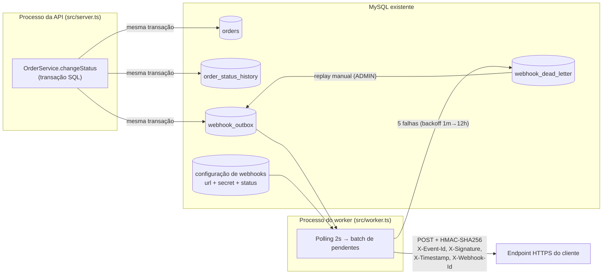

# RFC — Sistema de Webhooks de Notificação de Pedidos

| Campo | Valor |
| --- | --- |
| **Autora** | Larissa (Tech Lead) |
| **Status** | Em revisão |
| **Data** | Reunião técnica de quinta-feira, 09:00 (`TRANSCRICAO.md`) |
| **Revisores** | Marcos (PM), Bruno (Eng. Pleno, Pedidos), Diego (Eng. Sênior, Plataforma), Sofia (Eng. de Segurança) |
| **Documentos relacionados** | [PRD](PRD.md) · [FDD](FDD.md) · [ADRs](adrs/) |

## TL;DR

Propomos notificar clientes B2B sobre mudanças de status de pedidos via **webhooks outbound**, usando o padrão **Transactional Outbox no MySQL existente**: a mudança de status e o registro do evento acontecem na mesma transação SQL, e um **worker em processo separado** (polling de 2s) entrega os eventos por HTTP com assinatura **HMAC-SHA256**, retry com backoff exponencial (5 tentativas) e **DLQ** para falhas permanentes. Garantia de entrega **at-least-once**, com deduplicação pelo cliente via `X-Event-Id`. Nenhuma infraestrutura nova; reuso máximo dos padrões do projeto. Estimativa: **3 sprints** ([09:45]–[09:47]).

## Contexto e problema

Três clientes B2B — Atlas Comercial, MaxDistribuição e Nova Cargo — pediram formalmente para serem notificados em tempo real quando o status dos pedidos deles muda. Hoje eles fazem polling no `GET /orders`, o que torna a integração lenta e cara; a Atlas sinalizou que pode migrar para o concorrente se isso não for entregue até o fim do trimestre ([09:00] Marcos). Para esses clientes, "tempo real" é qualquer notificação **abaixo de 10 segundos** ([09:02] Marcos). O fluxo é apenas outbound: nós enviamos, eles recebem ([09:02] Marcos, [09:03] Sofia).

O OMS não possui hoje nenhum mecanismo de notificação externa, eventos ou filas. O ciclo de vida do pedido é controlado pela máquina de estados de `src/modules/orders/order.status.ts` e persistido pela transação do método `changeStatus` em `src/modules/orders/order.service.ts`, que atualiza o pedido, grava auditoria em `order_status_history` e ajusta estoque — qualquer solução precisa se acoplar a essa transação sem torná-la mais lenta ou frágil ([09:04] Bruno).

## Proposta técnica

A proposta se apoia em sete decisões, cada uma registrada em ADR próprio:

1. **Outbox transacional no MySQL** ([ADR-001](adrs/ADR-001-outbox-transacional-no-mysql.md)): dentro da mesma transação do `changeStatus`, inserimos o evento em `webhook_outbox`. Commitou a transação, o evento existe; rollback, o evento some junto ([09:06] Diego). O filtro de interesse é aplicado **na inserção**: se nenhum webhook do customer escuta aquele status, nem inserimos ([09:34] Bruno).
2. **Worker separado em polling** ([ADR-002](adrs/ADR-002-worker-em-processo-separado-com-polling.md)): entry-point nova `src/worker.ts` (`npm run worker`), mesmo banco, `PrismaClient` próprio, varrendo pendentes a cada 2 segundos — latência bem abaixo do teto de 10s. Single-worker nesta fase: ordering garantida apenas por pedido, limitação documentada ([09:13] Larissa).
3. **Retry com backoff + DLQ** ([ADR-003](adrs/ADR-003-retry-com-backoff-exponencial-e-dlq.md)): 5 tentativas (1m/5m/30m/2h/12h, ~15h de janela), timeout de 10s por chamada; depois disso o evento vai para `webhook_dead_letter` com payload, motivo e timestamp, reprocessável por endpoint admin (`ADMIN` + log de auditoria).
4. **HMAC-SHA256 com secret por endpoint** ([ADR-004](adrs/ADR-004-hmac-sha256-com-secret-por-endpoint.md)): assinatura do corpo no header `X-Signature`; secret única por endpoint, gerada por nós, rotacionável com grace period de 24h; URLs `https` obrigatórias.
5. **At-least-once com `X-Event-Id`** ([ADR-005](adrs/ADR-005-entrega-at-least-once-com-x-event-id.md)): duplicatas são possíveis e esperadas; o cliente deduplica pelo UUID do evento, como fazem Stripe e GitHub ([09:25] Diego).
6. **Reuso dos padrões do projeto** ([ADR-006](adrs/ADR-006-reuso-dos-padroes-existentes-do-projeto.md)): módulo `src/modules/webhooks/` no formato dos existentes; erros estendem `AppError` com prefixo `WEBHOOK_`; Pino, error middleware, Zod e `requireRole` reaproveitados sem mudança.
7. **Payload como snapshot** ([ADR-007](adrs/ADR-007-payload-snapshot-na-insercao-da-outbox.md)): o JSON final é renderizado na inserção na outbox e nunca re-renderizado — o evento reflete o estado do pedido no instante da transição.

A API pública do módulo (CRUD de configuração de webhooks, consulta de histórico de entregas, rotação de secret, replay de DLQ) segue autenticação JWT normal; `customer_id` vem no body/path, não do JWT ([09:32] Larissa). Contratos, payloads e matriz de erros estão detalhados no [FDD](FDD.md).

## Alternativas consideradas

| Alternativa | Trade-off que motivou o descarte |
| --- | --- |
| **Disparo síncrono no service de orders** | A transação de mudança de status já é pesada (orders + history + estoque); uma chamada HTTP no meio faria cliente lento travar mudanças de status de outros pedidos, e cliente fora do ar não tem resposta boa — rollback de status por falha de notificação é inaceitável ([09:04] Bruno; [09:06] Diego: "fora de questão"). |
| **Fila externa (Redis Streams ou similar)** | Resolveria o desacoplamento, mas exige subir e operar infraestrutura nova; para um time pequeno é overengineering quando o outbox no MySQL existente entrega a mesma garantia ([09:07] Larissa e Diego). |
| **Trigger no MySQL para reatividade** | MySQL não tem NOTIFY/LISTEN; trigger só executa SQL e não avisa processo externo — precisaria de improviso (arquivo, endpoint interno). Polling de 2s atende o requisito de <10s sem gambiarra ([09:09] Diego). |
| **Retry com apenas 3 tentativas / retry indefinido** | 3 tentativas morrem em ~30min e matariam eventos de clientes com manutenção de horas (caso real); retry indefinido deixa evento pendurado para sempre se o cliente sumiu ([09:15]–[09:16] Diego). |
| **Garantia exactly-once** | Exigiria coordenação dos dois lados e complexidade muito maior; at-least-once com `event_id` é o padrão de mercado e resolve 99% dos casos ([09:25] Diego). |

## Questões em aberto

1. **Rate limiting de saída** — se um cliente tem 50 pedidos mudando de status em um minuto, hoje bombardearemos o endpoint dele com 50 chamadas. Decisão adiada: "observar e decidir depois" ([09:38]–[09:39] Diego e Larissa).
2. **Alerta ao cliente sobre webhook com problema (e-mail)** — notificar por e-mail após falhas consecutivas ficou explicitamente para uma próxima fase, após medir impacto ([09:37] Larissa).
3. **Escala para múltiplos workers** — exigiria particionamento por `order_id` ou lock pessimista para preservar ordering; "problema do futuro" ([09:13] Diego).
4. **Arquivamento da outbox** — linhas entregues arquivadas após ~30 dias; fora do escopo desta feature ([09:08] Diego).

## Impacto e riscos

- **Impacto no código existente:** concentrado e pequeno — a transação do `changeStatus` em `src/modules/orders/order.service.ts` passa a chamar uma função de publicação que recebe o `tx` da transação atual ([09:41] Bruno/Diego); duas entradas novas de composição (`src/app.ts`, `src/routes/index.ts`); novas tabelas no `prisma/schema.prisma`. Nenhum comportamento existente muda.
- **Impacto operacional:** um processo novo para operar (worker). Se ele cair, eventos acumulam na outbox até voltar — monitoramento de lag é requisito de observabilidade (ver FDD).
- **Risco de segurança:** exposição de dados de pedidos a endpoints externos, mitigada por HMAC, TLS obrigatório, secret por endpoint e rotação. **Sofia exige pelo menos 2 dias úteis de revisão de segurança (HMAC e geração de secret) antes do deploy** ([09:46] Sofia).
- **Risco de prazo:** compromisso com a Atlas para fim do trimestre; estimativa de 3 sprints já inclui a revisão de segurança ([09:45]–[09:47]).
- **Risco de duplicidade no cliente:** inerente ao at-least-once; mitigado por `X-Event-Id` + documentação destacada no portal ([09:26] Marcos).

## Decisões relacionadas

- [ADR-001 — Outbox transacional no MySQL](adrs/ADR-001-outbox-transacional-no-mysql.md)
- [ADR-002 — Worker em processo separado com polling](adrs/ADR-002-worker-em-processo-separado-com-polling.md)
- [ADR-003 — Retry com backoff exponencial e DLQ](adrs/ADR-003-retry-com-backoff-exponencial-e-dlq.md)
- [ADR-004 — HMAC-SHA256 com secret por endpoint](adrs/ADR-004-hmac-sha256-com-secret-por-endpoint.md)
- [ADR-005 — Entrega at-least-once com X-Event-Id](adrs/ADR-005-entrega-at-least-once-com-x-event-id.md)
- [ADR-006 — Reuso dos padrões existentes do projeto](adrs/ADR-006-reuso-dos-padroes-existentes-do-projeto.md)
- [ADR-007 — Payload snapshot na inserção da outbox](adrs/ADR-007-payload-snapshot-na-insercao-da-outbox.md)
